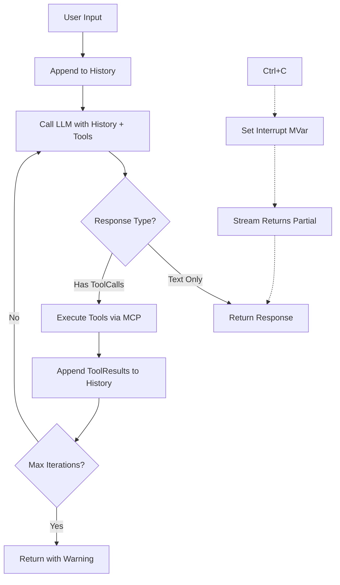

# Design Log #002: Agent Loop (Phase 4)

## Background

Telos is a Haskell agentic tool. Phase 1-3 completed:
- MCP Client with background dispatcher thread for bi-directional JSON-RPC
- GitHub Copilot LLM provider with OAuth Device Flow
- SSE streaming via Conduit

Phase 4 implements the core agent loop that orchestrates LLM ↔ MCP tool execution.

## Problem

Need to implement:
1. Conversation state management (history, tool registry)
2. Core loop: User input → LLM → Tool calls → LLM → ... → Final response
3. Graceful interrupt handling (Ctrl+C during streaming)
4. Effect stack composition

## Questions and Answers

**Q1: How should conversation history be structured?**
A1: Use a list of `Message` (already defined in Core.Types). Store in `TVar` for thread-safe updates during streaming.

**Q2: How to handle tool calls in the loop?**
A2: When LLM returns `ToolCall`s, execute each via MCP, collect results as `ToolResultMessage`, append to history, re-call LLM.

**Q3: How to handle interrupts during streaming?**
A3: Use `MVar ()` as interrupt signal. Check it in stream processing. On Ctrl+C, set MVar, return partial result.

**Q4: What's the maximum loop iterations to prevent infinite loops?**
A4: Default 20 iterations. Configurable via `AgentConfig`.

**Q5: Should we support multiple MCP servers?**
A5: Yes, use `ServerManager` (already exists). Tools are namespaced by server name.

## Design

### Module Structure

```
src/Telos/Agent/
├── Context.hs    -- AgentContext, conversation state
├── Loop.hs       -- Core agent loop logic
├── Interrupt.hs  -- Ctrl+C handling
└── Config.hs     -- AgentConfig

src/Telos/App.hs  -- Effect stack composition, main entry
```

### Core Types

```haskell
-- Agent/Config.hs
data AgentConfig = AgentConfig
  { acMaxIterations   :: Int           -- Default 20
  , acSystemPrompt    :: Maybe Text
  , acModel           :: Text          -- e.g. "gpt-4"
  , acMCPServers      :: [MCPServerConfig]
  }

data MCPServerConfig = MCPServerConfig
  { mscName    :: Text
  , mscCommand :: FilePath
  , mscArgs    :: [String]
  , mscEnv     :: [(String, String)]
  }

-- Agent/Context.hs
data AgentContext = AgentContext
  { ctxHistory      :: TVar [Message]
  , ctxTools        :: TVar [Tool]        -- Aggregated from all MCP servers
  , ctxInterrupt    :: MVar ()            -- Signal for Ctrl+C
  , ctxConfig       :: AgentConfig
  }
```

### Agent Loop Flow



### Key Functions

```haskell
-- Agent/Context.hs
newAgentContext :: AgentConfig -> IO AgentContext
addMessage :: AgentContext -> Message -> IO ()
getHistory :: AgentContext -> IO [Message]
getTools :: AgentContext -> IO [Tool]
registerTools :: AgentContext -> [Tool] -> IO ()

-- Agent/Loop.hs
data AgentResult
  = AgentResponse Text              -- Final text response
  | AgentInterrupted Text           -- Partial response on Ctrl+C
  | AgentMaxIterations Text         -- Hit iteration limit
  | AgentError AppError

runAgentLoop 
  :: Members '[LLM, MCP, Logger, Embed IO] r
  => AgentContext 
  -> Text           -- User input
  -> Sem r AgentResult

-- Single iteration
agentStep
  :: Members '[LLM, MCP, Logger, Embed IO] r
  => AgentContext
  -> Sem r (Either AgentResult ()) -- Left = done, Right = continue

-- Agent/Interrupt.hs
withInterruptHandler :: AgentContext -> IO a -> IO a
checkInterrupted :: AgentContext -> IO Bool
signalInterrupt :: AgentContext -> IO ()

-- App.hs
data AppConfig = AppConfig
  { appAgent    :: AgentConfig
  , appProvider :: ProviderConfig  -- LLM provider selection
  }

runApp :: AppConfig -> IO ()
```

### Effect Stack

```haskell
type AppEffects =
  '[ LLM
   , MCP
   , Logger
   , Process
   , Error AppError
   , Embed IO
   , Final IO
   ]

runAppEffects 
  :: ServerManager 
  -> CopilotAuth 
  -> Sem AppEffects a 
  -> IO (Either AppError a)
```

### Tool Execution Strategy

1. LLM returns `[ToolCall]`
2. For each `ToolCall`:
   - Parse tool name: `"serverName/toolName"` or just `"toolName"`
   - Find server, call `MCP.callTool`
   - Convert `ToolResult` → `ToolResultMessage`
3. Append all `ToolResultMessage`s to history
4. Re-invoke LLM

### Interrupt Handling

```haskell
-- In stream processing conduit
collectWithInterrupt :: AgentContext -> ConduitT StreamEvent Void IO StreamResult
collectWithInterrupt ctx = do
  interrupted <- liftIO $ checkInterrupted ctx
  if interrupted
    then do
      partial <- getCurrentPartial
      pure $ Interrupted partial
    else await >>= processEvent
```

## Implementation Plan

### Phase 4a: Config & Context
1. Create `Agent/Config.hs` with `AgentConfig`, `MCPServerConfig`
2. Create `Agent/Context.hs` with `AgentContext`, state management functions
3. Add `fromMaybe`, STM imports as needed

### Phase 4b: Interrupt Handling
1. Create `Agent/Interrupt.hs`
2. Install SIGINT handler that sets interrupt MVar
3. Modify streaming to check interrupt flag

### Phase 4c: Agent Loop
1. Create `Agent/Loop.hs`
2. Implement `agentStep` - single LLM call + tool execution
3. Implement `runAgentLoop` - iterate until done/interrupted/max
4. Handle tool name parsing and routing

### Phase 4d: App Composition
1. Create `App.hs`
2. Wire up effect interpreters
3. Create main REPL loop: read input → runAgentLoop → print output

### Phase 4e: Testing
1. Create `app/TestAgent.hs`
2. Test with filesystem MCP server
3. Verify interrupt handling works

## Examples

### Good: Tool Call Flow
```
User: "List files in /tmp"

History: [UserMessage "List files in /tmp"]
         ↓
LLM Response: ToolCall "filesystem/list_directory" {path: "/tmp"}
         ↓
MCP Call: list_directory(/tmp) → ["a.txt", "b.txt"]
         ↓
History: [UserMessage "...", AssistantMessage (toolCalls=[...]), 
          ToolResultMessage "filesystem/list_directory" "[\"a.txt\", \"b.txt\"]"]
         ↓
LLM Response: "The /tmp directory contains: a.txt, b.txt"
         ↓
Return: AgentResponse "The /tmp directory contains: a.txt, b.txt"
```

### Good: Interrupt Handling
```
User: "Analyze this large codebase"
         ↓
LLM streaming... "I'll start by examining the..."
         ↓
User: Ctrl+C
         ↓
Return: AgentInterrupted "I'll start by examining the..."
```

## Trade-offs

| Decision | Pro | Con |
|----------|-----|-----|
| TVar for history | Thread-safe, composable | Slight overhead |
| MVar for interrupt | Simple, reliable | Only binary signal |
| Tool namespacing | Clear server routing | Longer tool names |
| Max iterations | Prevents infinite loops | May cut off legitimate long chains |

## Open Questions

1. Should we support parallel tool execution? (Defer to Phase 5)
2. Token counting for context window management? (Defer to Phase 5)
